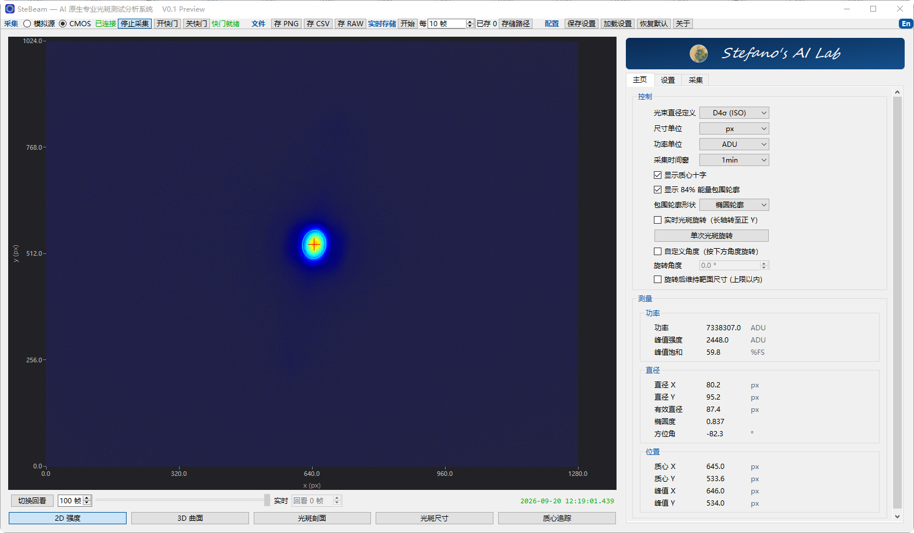
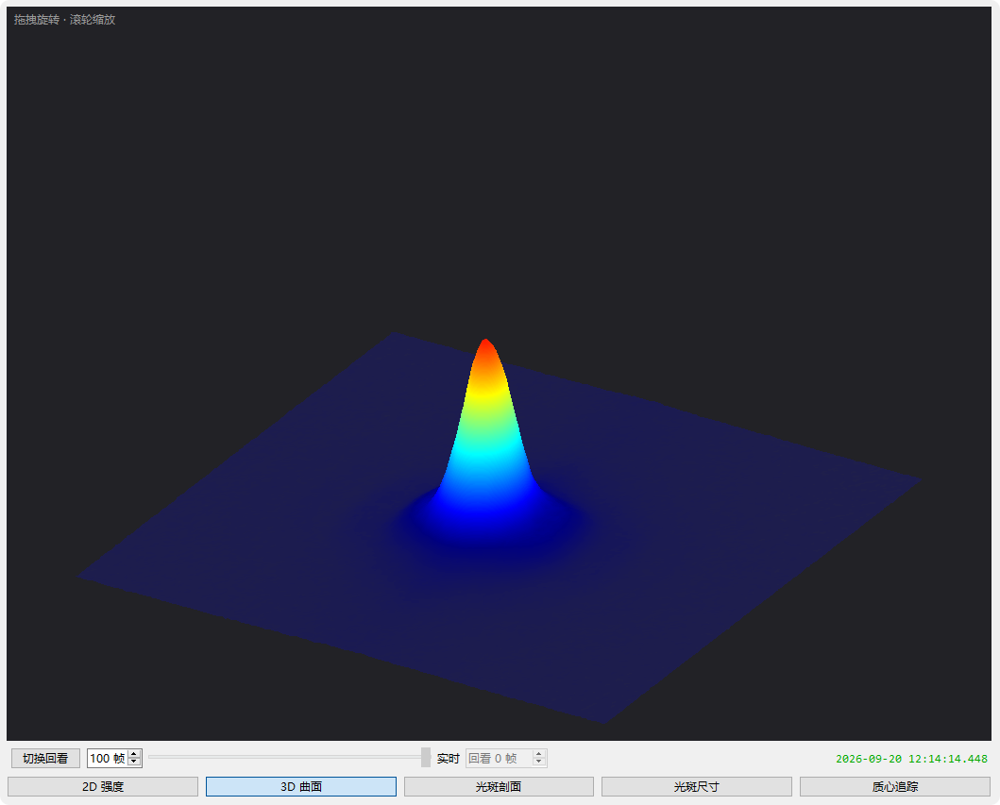
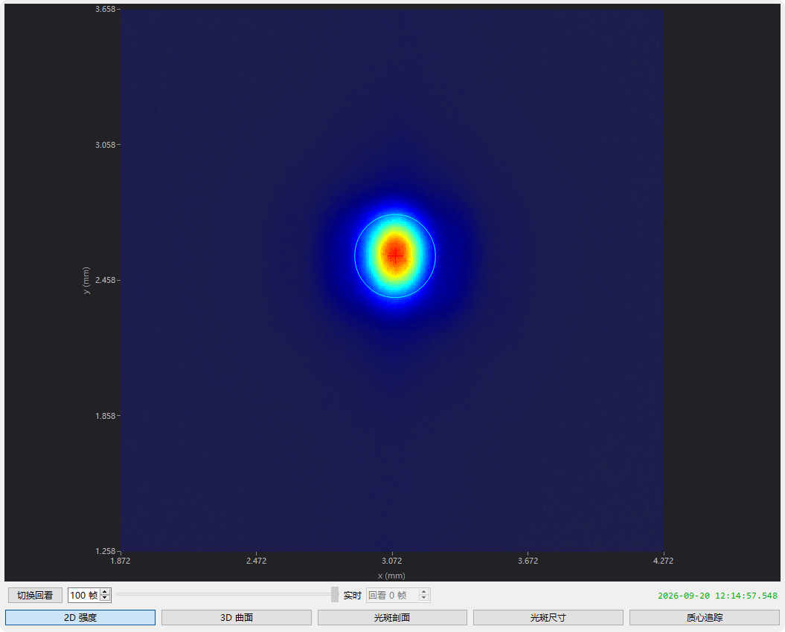
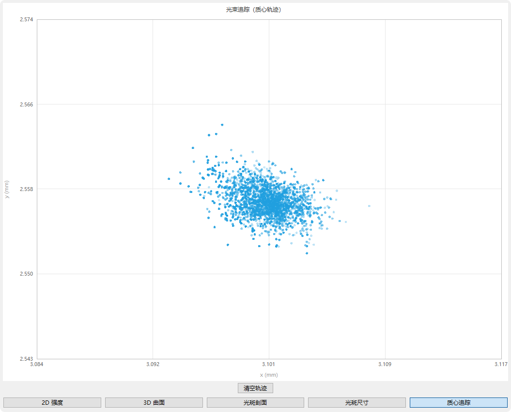

# SteBeam

[English](README.md) · 中文

## ——送给所有光学人的礼物

  

**一台普通的工业相机 + SteBeam = 一台专业的光束分析仪。**

---

## 为什么做它

测量激光光束质量、分析光斑强度分布依赖昂贵的商用光束分析仪，但是很多时候我们并不需要出具标准数据，我们需要的功能一台普通的工业相机即可具备，只是工业相机没有合适的测量分析软件。

SteBeam 是一款功能强大的光束分析软件，由资深光学工程师监督，AI 自动调试迭代，人机协同校对而成。但是需要注意的是，功率是根据相机产品手册中的光谱响应曲线（QE 曲线）换算得到，曲线范围外的红外波段做了拟合外推，并未经过实际标定。因此功率读数无法保证准确。如果您在使用过程中有条件实测功率，可使用标定系数功能微调。我们不宣称取代专业商用仪器，我们想做的是：**让百元级的工业相机具备实验室级的光束分析能力。**

## 获取

- **Windows 安装包**：我们提供了封装好的 `.exe` 安装包，见 **Releases**，可以直接在 Windows 10 及以上系统安装使用；
- **源代码**：本仓库即 SteBeam v0.1 完整源码，LGPL-3.0-or-later 许可，构建方法见[构建指南](BUILDING.md)；
- **使用手册**：[PDF（中文）](<manual/SteBeam 用户手册.pdf>) · [PDF（英文）](<manual/SteBeam User Manual.pdf>) · [HTML（双语）](manual/manual.html)。

## 特点摘要

1. **标准口径的测量核**
   D4σ 束宽遵循 ISO 11146 二阶矩法；另备 84% 能量宽度（抗杂散光）与 FWHM 直径定义，一键切换。椭圆度、长轴方位角、质心、峰值、功率每帧同步产出，全软件统一坐标口径，读数与导出数据完全对得上。

2. **五种实时视图，外加帧回放**
   2D 伪彩强度图、可拖拽旋转的 3D 光斑曲面、X/Y 剖面曲线、直径-时间滑窗曲线、质心漂移轨迹——从形貌到时域，一扇窗看全；内置百帧回放缓冲，随时冻结采集、逐帧回看最近的光斑历史。

3. **纯软件渲染，40 fps 以上稳定流畅**
   3D 曲面由自研渲染核逐像素绘制，不挑显卡，集成显卡也跑得流畅；500 px × 500 px 画面纯软件渲染帧率稳定在 40 fps 以上，每一帧都完成全部参数测量，切走再切回的视图数据一帧不丢——流畅不是调出来的，是架构出来的。

4. **光束找平**
   一键把椭圆光斑的长轴转到竖直方向，实时旋转 / 单次旋转 / 自定义角度三种模式随选；位置读数自动换算回真实坐标，比对、写报告、批量分析都干净利落。

5. **自动背景扣除**
   配合可选快门附件，一键完成「关快门 → 采暗帧 → 扣除 → 恢复光路」；没有快门附件也有手动遮挡采样路径，功能完整不打折。

6. **数据自由**
   测量结果实时导出 CSV，光斑图像随时保存，原始像素一键输出 RAW 供专业软件二次分析；内置光度标定链，外接功率计单点标定即可校准绝对功率。数据自动永久保留。

7. **质心云图**
   质心追踪视图是我最喜欢的功能，可以直观看到光斑质心随机性很强的行走路径，像一台随机数生成器，非常有趣。

## 界面实拍

主界面（主页读数面板）：

3D 光斑曲面，鼠标拖拽任意旋转：

2D 伪彩强度图（旋转校正）：

质心轨迹：

## 适合谁

- **高校与研究所实验室**；
- **激光设备教学**；
- **产线与装机调试**；
- **自建设备集成**。

## 支持的硬件

SteBeam v0.1 基于海康机器人 MV-CU013-A0UM 工业面阵相机与大恒 GCI-7103M 三通道快门（经 GCI-73M-USB 驱动器连接）开发与标定，目前适用这两款设备。后续将开发适配更多相机的通用接口。

## 源码与许可

SteBeam 是自由软件：您可以依自由软件基金会发布的 GNU 宽通用公共许可证（LGPL-3.0-or-later，可选任何后续版本）重新分发和/或修改它，全文见 [LICENSE](LICENSE)。LGPL-3.0 内嵌 GPL-3.0 条款，其全文见 [LICENSES/GPL-3.0.txt](LICENSES/GPL-3.0.txt)。测量结果按「现状」提供，不构成计量认证依据。

第三方组件许可与归属文本索引见 [LICENSES/THIRD-PARTY-NOTICES.md](LICENSES/THIRD-PARTY-NOTICES.md)，全文在 `LICENSES/third-party/`。

商用或服务咨询请联系：steagent@163.com

---

**SteBeam** · Stefano's AI Lab · LGPL-3.0-or-later
